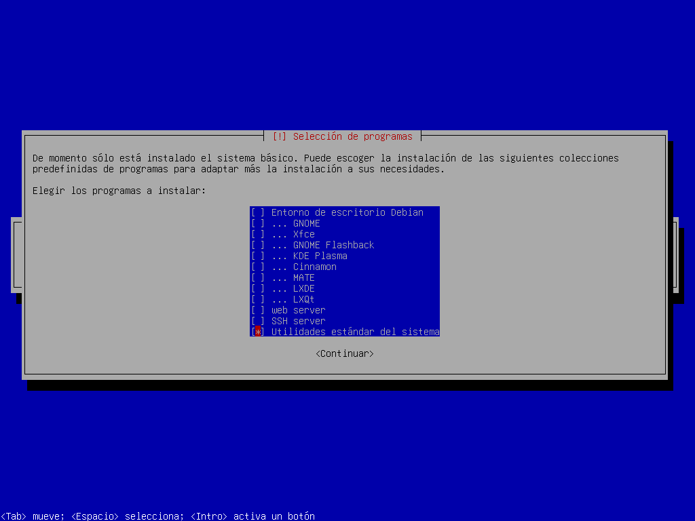

# Tutorial para instalar xfce4 en Debian

En el proceso de instalación asegurarse de desmarcar las opciones de **Entorno de Gnome** y **Gnome**


Al reiniciar iniciar sesión
Comandos a usar

**Instalar xfce4**
```bash
sudo apt install xfce4
```
```bash
sudo reboot
```
Plugins y herramientas utiles
Terminal
```bash
sudo apt install xfce4-terminal
```
Portapapeles
```bash
sudo apt install xfce4-clipman-plugin
```
Menu de aplicaciones Whisker
```bash
sudo apt install xfce4-whiskermenu-plugin
```
Captura de pantalla
```bash
sudo apt install xfce4-screenshooter
```
Editor de perfil
```bash
sudo apt install mugshot
```
Bluetooth
```bash
sudo apt install blueman
```

## Instalación de NetworkManager
instalar NetworkManager
```
sudo apt install network-manager-gnome
```
**Configurar Red**
```bash
sudo nano /etc/network/interfaces
```
Comentar esta parte
```conf
# The primary network interface
#allow-hotplug wlo1
#iface wlo1 inet dhcp
#       wpa-ssid SSID-wifi
#       wpa-psk  Contraseña-wifi
```

reiniciar network manager o simplemente reiniciar sistema:

```bash
sudo systemctl restart NetworkManager
```

## Configurar inicio de sesión
Configurar incio de sesión
```bash
sudo apt install lightdm-gtk-greeter-settings
```
Para lograr que Debian con XFCE4 te pida solo la contraseña al iniciar sesión (es decir, que el nombre de usuario ya esté pre-seleccionado o auto-completado), debes configurar tu gestor de inicio de sesión.
``` bash
sudo nano /etc/lightdm/lightdm.conf
```
Poner **greeter-hide-users** en false
```conf
[Seat:*]
greeter-hide-users=false
```
```
sudo systemctl restart lightdm
```
## Instalación de Flatapk
```bash
sudo apt install flatpak
```
Agregar repositorio Flathub
```
flatpak remote-add --if-not-exists flathub https://dl.flathub.org/repo/flathub.flatpakrepo
```
## Instalación de Snap
```bash
sudo apt install snapd
```
```bash
sudo snap install snapd
```
Integracion de Snap al menu de aplicaciones
``` bash
sudo ln -s /var/lib/snapd/desktop/applications /usr/share/applications/snapd
```